<h1 align= "center"> Peekaboo Web Application </h1>
<br/>
<br/>
<br/>
<br/>
<br/>

<p align="center">
Nguyen Duc Thang (16709) (Team Leader) <br/>
Hua Nhat Gia Nghi (18242) <br/>
Nguyen Quoc Trung (15657) <br/>
Nguyen Phu Khang (16580) <br/>
Nguyen Duy Phu Quang (15890) <br/>
Vu Nhat Quang (16141) <br/>
Ngo Phuc Linh  (14327) <br/>
Truong Canh Thanh Vinh (15766) <br/>

<br/>
<br/>
<br/>
<br/>
<br/>
<br/>

<p align= "center">
Course: Programming Exercise <br/>
Lecturer: Huynh Trung Hieu <br/>
Due Date: 20th June, 2022 <br/>
</p>
<br/>
<br/>

--------------------------------

# 1. Acknowledgements <a name="acknowledgements"> </a>

<br/>
<p align="right">
Nguyen Duc Thang <br/>
Team 3 <br/>
Class: Programming Exercise <br/>
Vietnamese German University <br/>

Pro. Huynh Trung Hieu
Vietnamese German University
<br/>

Dear Prof. Huynh Trung Hieu,
Please find below our reports on Peekaboo, which is part of the subject Programming Exercise.

This report gives you information about the inner workings of the project from overviews and software design perspective while providing an easy-to-understand diagram, and also further information about pros and cons of the project.
Thank you for tanking the time to read this report and I hope it meets with your approval. If you have any questions, please do not hesitate contact me by email: Nickworkspace189@gmail.com.
<br/>
<br/>
Sincerely yours,
Nguyen Duc Thang
Team leader.
<br/>

--------------------------------

# 2. Abstraction <a name="abstraction"> </a>

The Peakapoo is web application built using Golang for backend and using React, Typescript for frontend with some modern libraries to pro a graphical user interface.

*Key word: Web application, Golang, React, Typescript.*

--------------------------------

# Table of content

1. [Acknowledgements](#acknowledgements)
2. [Abstraction](#abstraction)
3. [Introduction](#Introduction)
    3.1 [Purpose](#purpose)
    3.2 [Audience](#audience)
    3.3 [Constain](#constain)
    3.4 [Team Members Tasks](#task)
    3.5 [Scrum Review](#scrumReview)
        3.5.1 [Report](#report)
        3.5.2 [Retrospective](#retrospective)
4. [Project Overview](#projectOverview)
    4.1 [Overview Architecture](#OverviewArchitecture)
    4.2 [Brief Description of Clean Architecture](#briefDescription)
    4.3 [Product Backlog](#productBacklog)
    4.4 [Usecase Diagrams](#usecaseDiagrams)
    4.5 [ER Diagrams](#erDiagrams)
    4.6 [Class Diagrams](#classDiagrams)
    4.7 [Activity Diagrams](#activityDiagrams)
5. [Software Architecture](#software)
    5.1 [Server Runtimes](#serverRuntimes)
    5.2 [Database](#database)
    5.3 [Backend Software](#backend)
    5.4 [Deployment Framework](#deployment)
    5.5 [Software functions](#softwareFunctions)
        5.5.1 [Registration function](#registrationFunction)
        5.5.2 [Login function](#loginFunction)
        5.5.3 [Logout function](#logoutFunction)
        5.5.4 [Group function](#groupFunction)
        5.5.5 [Test function](#testFunction)
        5.5.6 [Performance view](#performanceView)
    5.6 [Administrator management](#adminFunciton)
        5.6.1 [Admin Interface](#adminInterface)
        5.6.2 [Backend Management](#adminBackend)
6. [User manual](#userManual)
    6.1 [How to use the web application](#using)
    6.1.1 [User registration](#userRegistration)
    6.1.2 [User login](#userLogin)
    6.1.3 [User logout](#userLogout)
    6.1.4 [User Profile](#userProfile)
    6.1.5 [User's classroom](#userGroup)
    6.1.6 [User's testing](#userTesting)
    6.1.7 [User's performance](#userPerformance)
7. [Conclusion](#conclusion)
   7.1 [Limitation](#limits)
   7.2 [Learning](#learning)
   7.3 [Future Development](#future)
8. [Appendix A: Glossary of Terms](#appendixA)
9. [Appendix B: Gantt Chart](#appendixB)

--------------------------------

# 3. Introduction <a name="introduction"> </a>

## 3.1 Purpose <a name="purpose"> </a>

We are Peekaboo, a software that focuses on developing applications for users, typically students and learners, to assess their ability by doing tests. Peekaboo resembles other assessment websites such as ieltsonlinetest.com, codeforce.com, etc.
However, we improve the styles and usability of the tests so that they are personalized and customized for admins and users.

## 3.2 Audience <a name="audience"> </a>

The report is for the instructor's review to determine our grade for the Programming Exercise course.

## 3.3 Project scope <a name="projectScope"> </a>

The report has been written to familiarize the audience with the features of the program while presenting the schedule and progress of the project.
A detailed explanation of the frameworks used and the application and functions are not included in this report. To mark this project as a success, we have to achieve the following requirements:

This application has 2 interfaces:

- User Interface
- Admin Interface

Users after registration can:

- View the group that has been assigned to them.
- Do the tests and get the test graded by Admin.
- View the total score of the previous tests.
- Do the test in many styles: multiple choice, fill in the blank, etc...

Admin of this application can:

- Assign the test to any Users.
- Analyze the scores of Users based on the test’s topics, users, or other criteria.

## 3.4 Team member position <a name="task"> </a>

| Team | Member |
| --- | --- |
| DevOps | Thang Nguyen Duc (Team leader) |
| User Interface Design | Vu Nhat Quang |
|                       | Ngo Phuc Linh |
|                       | Nguyen Duy Phu Quang |
| Front end developer   | Hua Nhat Gia Nghi (Lead FrontEnd) |
|                       | Nguyen Duc Thang|
|                       | Ngo Phuc Linh |
|                       | Nguyen Quoc Trung |
|                       | Nguyen Phu Khang |
| Backend Developer     | Nguyen Duc Thang (Lead BackEnd)|
|                       | Truong Canh Thanh Vinh |
| Documentation and report| Ngo Phuc Linh (Lead Documentation)|
|                       | Nguyen Duc Thang |
|                       | Hua Nhat Gia Nghi |

## 3.5 Scrum Review <a name="scrumReview"></a>

### 3.5.1 Retrospective <a name="retrospective"> </a>

#### 3.5.1a Sprint 1

After the day the project is assigned, we discussed and distribute tasks for each member to complete.Thus, we arranged 2 meetings weekly in order to review progress and keep track of the work.
**Current requirements:**

- Analyze requirements and select Architecture.
- Draw diagram for the project and write Product Backlog.
- Upload information into Gitlab and write proposal.
- UI Wireframes sketchs and design.
- Build Front-End Architecture and Init Code Base.

**Achievement:**

- We analyzed and illustrated how will the user service work and were able to assign tasks for members depending on their field of knowledge.
- We discussed and had agreements in the general functions and classes in the diagram.
- We decided to use Notion for managing and updating our work, Gitlab for building and storing material of application, and Messenger for online discussion during remote working.
- We also sketches and design the User Interface for the application and build Architecture and Init Code Base.
- We made plans for the next period of time as well as assigned work for each individual.

#### 3.5.1b Sprint 2

We had 3 meetings weekly to check our process as well as speed up to have extra time for reconsidering.
**Current requirements:**

- Build Database class and Database Exam.
- Create and code the front-end layout.
- Write the Test Result Usecase.
- Build Multi-level Transaction Management.
- Build the Listening and Reading format test.
- Create and write API.
- Build the Middleware.

**Achievement:**

- We accomplished the assigned tasks in Sprint 2.
- We made some preparation for the Final Documentation.
- We separated the task and work together to code Frontend Layout.
- We focused on build the Back-end and Front End function.
- We made plans for the next period of time as well as assigned work for each individual.

#### 3.5.1c Sprint 3

We had 3 meetings weekly to check our process as well as speed up to have extra time for reconsidering and working to complete the project.
**Current requirements:**

- Fetch database.
- Do the admin management UI and Functions.
- Complete tasks for Backend.
- Write the final document and slide for presentation.
- Deployment the web application.
- Review all the document and the project's code.

**Achievement:**

- We finished all the requirements.
- We had our Documentation done and had some modification.
- We successfully deployed the project to the website.

--------------------------------

# 4. Project Overview <a name="projectOverview"> </a>

## 4.1 Overview Architecture <a name= "OverviewArchitecture"> </a>

The Peekaboo project is created under a Three-tier architecture for a web application.

[Three-tier architecture][1] is a well-established software application architecture that organizes applications into three logical and physical computing tiers: the presentation tier, or user interface; the application tier, where data is processed; and the data tier, where the data associated with the application is stored and managed.

- Presentation tier: is the user interface and communication layer of the application. Web presentation tiers are developed using HTML, CSS, and JavaScript, React in our project.
- The application tier (also known as the logic tier or middle tier): collect information in the presentation tier is processed.
- The data tier called the database tier: is where the information processed by the application is stored and managed.

It gives us the ability to update the technology stack of one tier, without impacting other areas of the application. Besides that, it allows for different development teams to each work (meanwhile we work as 2 teams: Front-end and Back-end).
Moreover, it adds reliability and more independence to the underlying servers or services.

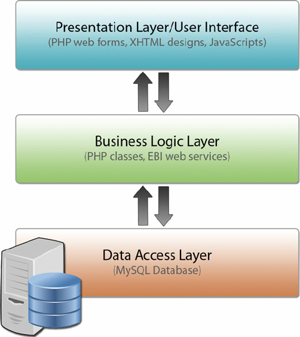

<p align= "center"> Overall Architecture </p>

## 4.2 Brief Description of Clean Architecture <a name="briefDescription"> </a>

The project is created as a web-based application, [Clean architecture of Uncle Bob][2] is a software design philosophy that separates the elements of a design into ring levels.
An important goal of clean architecture is to provide us with a way to organize code in such a way that it encapsulates the business logic but keeps it separate from the delivery mechanism. Clean Architecture separates stable business rules (higher-level abstractions) from volatile technical details (lower-level details), defining clear boundaries. The main building block is the Dependency Rule: source code dependencies must point only inward, toward higher-level policies.[3]

It should have the following characteristics:

- Testable
- Independent of frameworks
- Independent of the UI
- Independent of the database
- Independent of any external agency
It's very suitable for use with the Three-tier Architecture

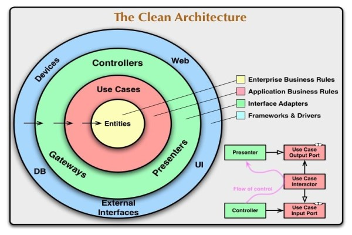

<p align= "center"> System: Clean Architecture </p>

## 4.3 Product Backlog <a name="productBacklog"> </a>

Product Backlog is the Master Board for teams **(Frontend, Backend)** to find the users’ demands. Each story will be picked for Sprint circle in order based on its priority and score. There are 2 types of user:

| Users | Note |
| --- | --- |
| Admin | [A] |
| Student | [S] |

| User Stories | Score | Priority (Top: 5 → Bottom: 1)  |
| --- | --- | --- |
| [S] I want to do test and view the score afterward.  | 2 | 5 |
| [A] I want to manage all the tests’ data. | 2 | 5 |
| [A] I want to manage all the students’ data. | 1.5 | 5 |
| [A] I want to be able to assign test to a group of students. | 1.5 | 5 |
| [A] I want to grade a student’s test. | 1.5 | 4 |
| [S] I want to view what I have done wrong in the test. | 1.5 | 4 |
| [S] I want to view my progress, and others people progress in my group through time. | 1 | 3 |
| [A] I want to view student’s performance through time on a cluster: {group, test, student} | 1 | 3 |
| [S] I want to view the comment admins made on my test. | 1 | 2 |

## 4.4 Usecase Diagrams <a name= "usecaseDiagrams"> </a>

At first, it is obvious that users have 2 fundamental services, which are login and take a test. In the login system, users can choose to register if they do not have an account or forget a password if they lose their account. Meanwhile, in the test system, users can take a test and receive the results immediately, also can review the answers.

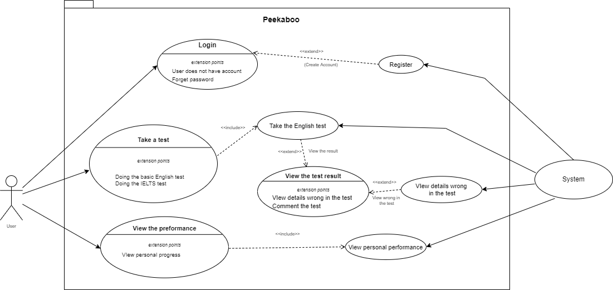
<p align= "center"> User use case diagram</p>

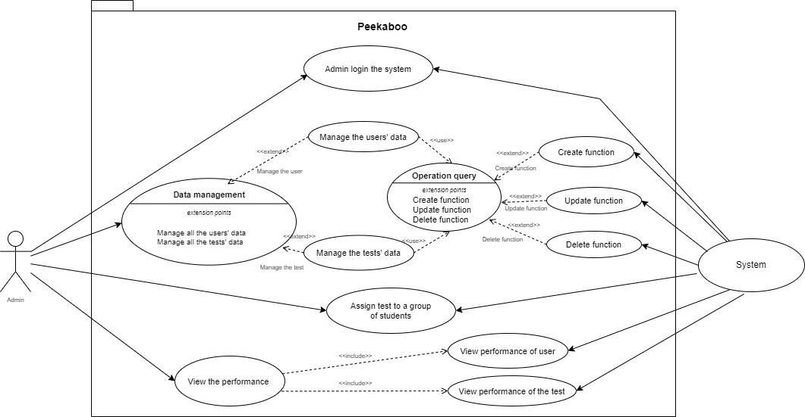
<p align= "center"> Admin use case diagram</p>

## 4.5 ER Diagrams <a name="erDiagrams"> </a>


<p align= "center"> ER diagram</p>

## 4.6 Class Diagrams <a name="classDiagrams"> </a>

Realizing the basic rule of a web application, which is user-oriented. Standing from the user’s story, we use basic role-based operation for defining user and admin. It is clear to see that classes and users share a common appointment class, which can simplify the whole system. Although our approach is not unique and still has some limitations, the lightweight system is a necessary method to implement and fulfill the requirement of the project.


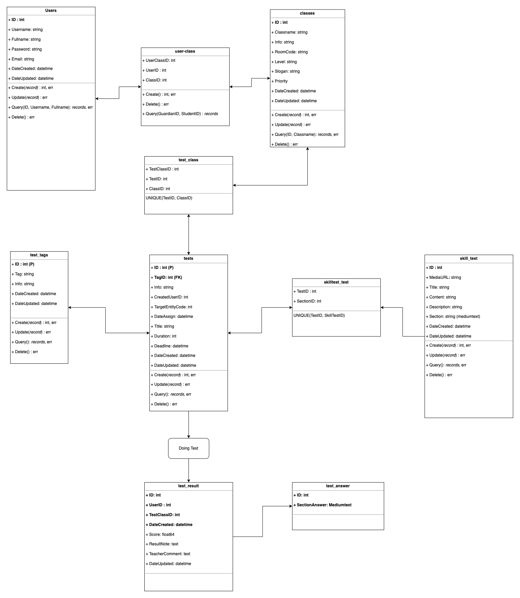
<p align= "center"> User class diagram relationship</p>

## 4.7 Activity Diagrams <a name="activityDiagrams"> </a>

The activity diagram illustrates the basic flow for client when accessing to our web application. Our main concentration is on the doing the test function, therefore, we try to split the operation into details.

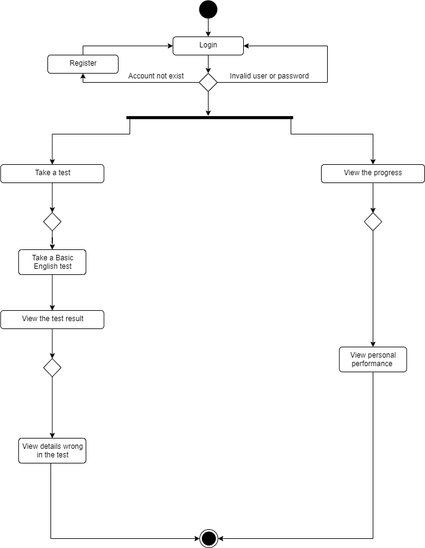
<p align= "center"> User activity diagram</p>

While, the activity diagram of administration illustrates the basic flow for admin when controlling to the database and web application. Our main concentration is not only on the querying operations (View, delete, update), but admin can also assign test to a group of students and view the performance of them.

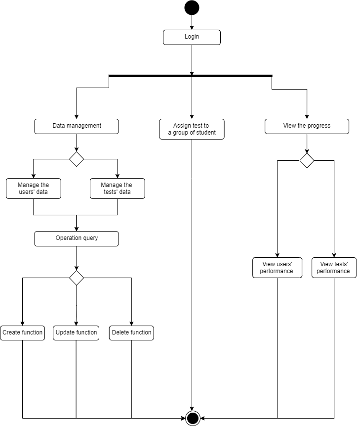
<p align= "center"> Admin activity diagram</p>

--------------------------------

# 5. Software Architecture <a name="softwareArchitecture"> </a>

## 5.1 Server runtimes <a name="serverRuntimes"> </a>

The web application runs on the Nginx which is a web server that can also be used as a reverse proxy, load balancer, mail proxy, and HTTP cache. We determine to use Nginx of some obvious advantages such as being more lightweight, and also requiring fewer resources, and memory. Besides, it can able to handle extensive simultaneous connections with low memory.

## 5.2 Database <a name="database"> </a>

Our database is MySQL 8.0, a very basic option due to reasons:

- MySQL is easy to used on for its basic query syntax.
- We understand the underline implementation and optimization of MySQL CRUD operations.
- MySQL on overall in cheaper in comparison to PostgreSQL.

We design our database to take advantages of MySQL, which is relationship and constraints accross schema. For example, we always indexing the primary key and reference foreign keys whenever possible to maintain the consistency of data.

## 5.3 Backend Implementation<a name="backendSoftware"> </a>

### Go

For backend, we implement it with Go (Golang). There are several reasons why we choose Go as our main server-side language:

- Go is fast: as a compile programming language with most of functionalities are supported by built-in library, Go is super fast. Our application should be able to handle extensive requests, as users and submit or redo the test many times, which requires backend service to process many complicated operations, which made it the right choice.
- Great community: Go community has grown over the past decades, and now matured. Most of the library you need can be found on **Github**, and most of them is qualified by the go package.
- Easy to learn and maintain: some of members in our groups only took at most 1 week to be quite confident writing code in Go. That is a very important point for our success.
- Concurrency: Go provide us with advance built-in concurrency. This is already provide to us from the **Gin** web framework.

### API Layer

Our API is build under the **handler** package. On overall, we have 28 API Endpoints for Users, Admins, Tests, Class, and Authentication/Authorization. All the data which is passed from Usecase Layers is formated under package **api_dto** before returning to the Frontend Service. Here, we construct a customized response structure in **gctx** package. The purpose is to always return the error together with the data if possible. Thus, make it easier to test and bridge the application:

```go
func (g *Gin) Response(httpCode int, data interface{}, GivenError error) {
 var msg string
 if GivenError == nil {
  msg = ""
 } else {
  msg = GivenError.Error()
 }

 field := classifyErrorResponse(GivenError)
 code := e.GetCode(GivenError)

 g.C.Header("Content-Type", "application/json")
 g.C.JSON(httpCode, gin.H{
  "data": data,
  "error": ErrorResponse{
   ErrorCode:  code,
   ErrorMsg:   msg,
   ErrorField: field,
  },
 })
}
```

In API Layer, most of the data is verified and checked against the format, so that we can quickly return the invalid input/ malfunctional request without passing it furthur to the underline layers.

For example: after declare the **Class** object for API layer, there must be 2 other functions, Validate function which validate the input, and BindClass which retrieve the object under the right JSON format.

```go
type Class struct {
 ID           int    `json:"id"`
 Classname    string `json:"className"`
 Info         string `json:"info"`
 Announcement string `json:"announcement"`
 RoomCode     string `json:"roomCode"`
 Level        string `json:"level"`
}

func (c Class) Validate(HasID bool, HasBody bool) error {
 if HasID && c.ID == 0 {
  return e.ErrorInputInvalid
 }

 if HasBody {
  if err := CheckStringLength([]string{c.Classname, c.Info, c.Level, c.RoomCode}, 2, 100, false); err != nil {
   return e.ErrorInputInvalid
  }

  return nil
 }
 return nil
}

func BindClass(c *gin.Context, HasID bool, HasBody bool) (Class, error) {
 var nc Class
 if err := c.ShouldBindJSON(&nc); err != nil {
  return Class{}, e.ErrorBindJSON
 }

 if err := nc.Validate(HasID, HasBody); err != nil {
  return Class{}, e.ErrorInputInvalid
 }

 return nc, nil
}
```

Under the **middleware** package you can find the supported middleware we have:

- CORS: prevent cross-origin requests
- Hashing: used to hash secrets before adding to database, e.g: password.
- Logger: to log the activities/errors of the application and save into a file for each day.
- Rate Limit: limit the number of requests per second to the application to prevent attacks such as DDoS.
- Tracer: provide information of request.
- Cookie & JWT: to save the session into user's cookie.

The above functions are crucial for the development of our application. Missing any of those would have detrimental effect on the operation.

In addition, concurrency is process here provided by the **Gin** framework. Thus, we do not have to worry about it.

### Registry

Registry is where we inject the necessary configuration and dependency (database connection, transaction configuration) into the **AccessPoint** pointer. The pointer then can be used to access the lower layer such as Usecase and Persistence/RDBMS layer.

One example can be seen here of the **TestAccessPoint**:

```go
type TestAccessPoint struct {
 Service usecase.TestService
}

func BuildTestAccessPoint(NeedTransaction bool, db *sql.DB) *TestAccessPoint {
 querier := NewQuerier(NeedTransaction, db)
 usecaselayer := interactor.NewTestUsecase(&querier)

 return &TestAccessPoint{
  Service: usecaselayer,
 }
}
```

Here, we initiate the database (querier) and usecase (usecaselayer) to inject into the **TestAccessPoint** service.

### Usecase Layer

Usecase Layer is where the business logic of our application happend. For example, the Submit Test function will execute the follow steps:

- 1. Take the test from the database.
- 2. Compare the test answer with the submitted test answer.
- 3. Compute the score of the test answer.
- 4. Open the transaction to create the test result and save the test answer into data.
- 5. Commit/Rollback if needed.

```go
// @transaction
// Steps:
// @1. Compare result to the database answer to produce the test result.
// @2. Insert the test answer into database.
func (t *TestUsecase) SubmitTest(ctx context.Context, data usecase_dto.SubmitData, userId int, entityCode int) (testResultId int, err error) {
 sk, err := t.TestRepository.QuerySkillTest(ctx, data.ID)
 if err != nil {
  return testResultId, err
 }

 if len(data.Sections) != len(sk.Section) {
  return testResultId, fmt.Errorf("The number of sections is not equal")
 }

 correctAns := 0
 totalAns := 0
 for i, section := range sk.Section {
  // @1. Compare result to the database answer to produce the test result.
  // @2. Save-up user's answer.
  if len(section.Content) != len(data.Sections[i].Answers) {
   return 0, fmt.Errorf("The number of sections is not equal")
  }

  for j, content := range section.Content {
   totalAns++
   if content.CorrectAns == data.Sections[i].Answers[j] {
    correctAns++
   }
  }
 }

 if err := t.TestRepository.EnableTx(func() error {
  // @1. Create test result
  testResultId, err = t.TestRepository.CreateTestResult(ctx, entity.TestResult{
   ID:          0,
   TestClassID: data.TestClassID,
   UserID:      userId,
   EntityCode:  entityCode,
   Score:       int(float32(correctAns) / float32(totalAns) * 100),
   Comment:     "N/A",
   ResultNote:  "Little Sloww",
  })

  if err != nil {
   return err
  }

  var entitySubmittedData entity.SubmittedAnswer
  if err := copier.Copy(&entitySubmittedData.Sections, &data.Sections); err != nil {
   return err
  }

  entitySubmittedData.ID = testResultId

  // @2. Insert the test answer into database.
  err = t.TestRepository.CreateTestAnswer(ctx, entitySubmittedData)
  if err != nil {
   return err
  }

  return nil
 }); err != nil {
  return testResultId, err
 }

 return testResultId, err
}

```

The Usecase Layer never call the query directly, the rather implement the abstraction of the database layer. Then, call the abstraction to execute the needed function. On the above example, you can see the TestRepository is the persisten abstraction, which hold all the required functions.

In addition, Usecase layer requires different structure in comparision to API Layer, thus we create another package call **usecase_dto** to hold the structure.

### Persistence Layer (Database Layer)

We implement this layer with out any use of ORM (some popular names are GORM, sqlx). The reason behind is that there has been study proved that ORM in certain case reduce the performance of the application, while improve the maintainance and implementation of the application. We do not want to trade this, so pure SQL is used everywhere.

For each of the entity and its relations (Many-to-many relationship), we create all 4 types of functions: Read - Create - Update - Delete.

All the functions are methods of variable **Querier**, which implements the interface **Repository** under repository package. This way, we can easily mock the persistence layer to test the usecase layer independently, without having to create another abstraction. The common mock package that we use are **gomock**.

## 5.4 Deployment <a name="deployment"> </a>

Due to the quite complicated set up of Gitlab CI/CD pipeline, we use one alternative approach is the Github Action.

For each of Backend and Frontend, we create a Dockerfile to containerize the service. For Frontend, an Nginx images is also used to host the built React Application after the multi-staged build process. All the details can be viewed under **.githubs/workflows** folder in our application.

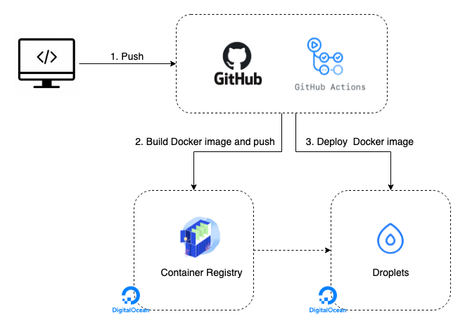
<p align= "center"> Sequence diagram represents deployment</p>

The code is first push to the github repository, and the github workflow code will be executed. There are 3 processes:

- build_push_server: build the dockerfile of api and push to the Digital Ocean's container registry.
- build_push_ui: build the dockerfile of ui and push to the Digital Ocean's' container registry.
- deploy: login to the droplets, and pull the above images to the droplets, then run them using the docker-compose.yml file.

There are 2 notices about this pipeline:

### Nginx

We need a webservice to encrypt the connection between the server and the client, and also to distribute request to the right service (UI or API), and NGINX is the best choice. We create the server block for the Nginx first, then use the follow configuration.

The UI will be delivered by the **/** route, while the **/api** will be distributed to the api service.

```nginx
server {

        root /var/www/peakaboo.ducthang.dev/html;
        index index.html index.htm index.nginx-debian.html;

        server_name peakaboo.ducthang.dev www.peakaboo.ducthang.dev;

        location / {
                proxy_pass http://127.0.0.1:5001/;
                proxy_set_header X-Real-IP $remote_addr;
                proxy_set_header X-Forwarded-For $remote_addr;
                proxy_set_header Host $host;
                #proxy_set_header X-Forwarded-For $proxy_add_x_forwarded_for;
        }

        location /api/ {
                proxy_pass http://127.0.0.1:8080;
                proxy_set_header X-Forwarded-For $remote_addr;
                proxy_set_header Host $host;
                proxy_set_header X-Real-IP $remote_addr;
        }

    listen [::]:443 ssl ipv6only=on; # managed by Certbot
    listen 443 ssl; # managed by Certbot
    ssl_certificate /etc/letsencrypt/live/peakaboo.ducthang.dev/fullchain.pem; # managed by Certbot
    ssl_certificate_key /etc/letsencrypt/live/peakaboo.ducthang.dev/privkey.pem; # managed by Certbot
    include /etc/letsencrypt/options-ssl-nginx.conf; # managed by Certbot
    ssl_dhparam /etc/letsencrypt/ssl-dhparams.pem; # managed by Certbot

}
server {
    if ($host = peakaboo.ducthang.dev) {
        return 301 https://$host$request_uri;
    } # managed by Certbot


        listen 80;
        listen [::]:80;

        server_name peakaboo.ducthang.dev www.peakaboo.ducthang.dev;
    return 404; # managed by Certbot


}
```

The second block of **server** tell the internet that the request to a non-http URL permanently direct to a secure URL in port 443. In addition, Certbot is used to manage our SSL certificate.

### Docker-compose

We use docker-compose to manage our services. The docker-compose.yml file in our Digital Ocean droplets is showned below:

```yml
version: "3"

services:
        api:
                env_file: /root/source.list
                container_name: vgu-api
                restart: always
                image: registry.digitalocean.com/gl-prod/vgu-api:${TAG}
                ports:
                        - "8080:8080"

        ui:
                restart: always
                image: registry.digitalocean.com/gl-prod/vgu-ui:${TAG}
                container_name: vgu-ui
                ports:
                        - "5001:80"
                depends_on:
                        - api

volumes:
        my-db:
```

## 5.5 Software function <a name="userInterfaces"> </a>

### 5.5.1 Registration function <a name="registrationFunction"> </a>

Users who have not yet registered will not be able to log in. They must first register by clicking the Register button.
The application also allows resetting the password for existing users in the database. All the passwords for the user will be hashed and saved in the database using the "bcrypt" hashing function. It allows us to build a password security platform that scales with computation power and always hashes every password with a salt. Its purpose is to slow down hackers using a dictionary and brute force attacks.

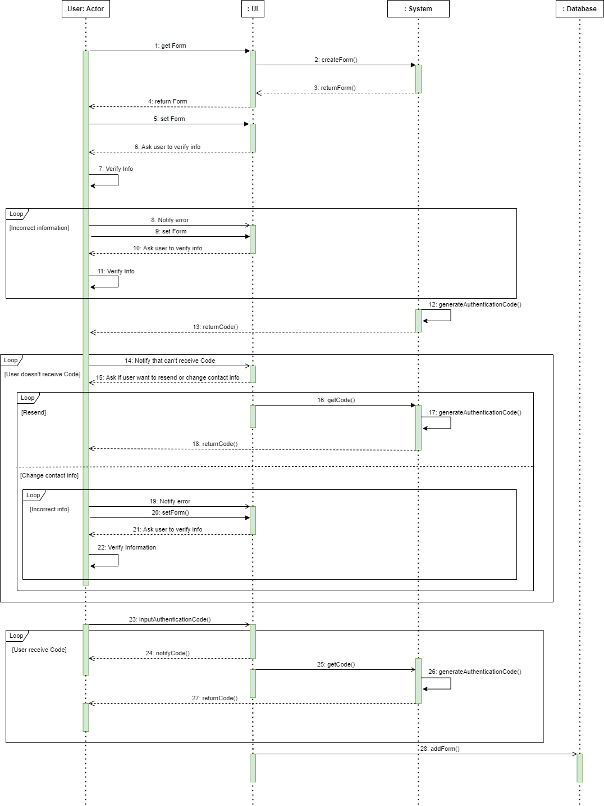
<p align= "center"> Sequence diagram represents registration function</p>

### 5.5.2 Login function <a name="loginFunction"> </a>

The login page is the first page users see in the application. It contains two text fields - one for entering a login name and one for entering a password - and a command button that initiates password verification. If either of the text fields is left blank, this is an error that should be communicated to the user. If both fields are filled in, but there is no entry for the user name or the password is incorrect, this must also be communicated to the user.

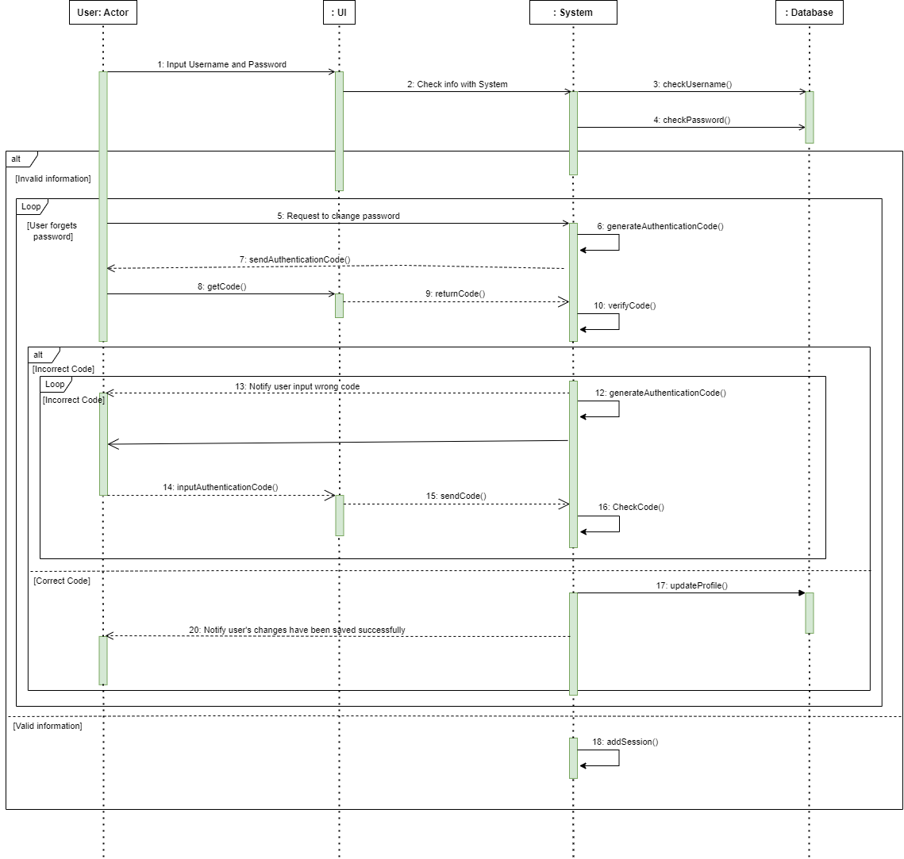
<p align= "center"> Sequence diagram represents login function</p>

### 5.5.3 Logout function <a name="logoutFunction"> </a>

In case the user has already done this session and wants to log out, the system will notify by the alert box with the warning message. If the user confirms an ending session, the system will end the session immediately.

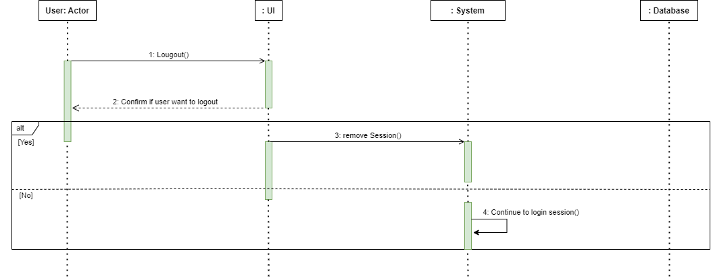
<p align= "center"> Sequence diagram represents logout function</p>

### 5.5.4 Group function <a name="groupFunction"> </a>

After login, the user will see the group information which is assigned by the admin for each student. User will see more information about the class. Each class will be received unique ID. Built based on "Class" database, the information of each class is.

### 5.5.5 Test function <a name="testFunction"> </a>

**CONTEXT:**
Test page uses TestContext to manage information about the test, including:

- testData: test type, audio, reading passage, sections (a group of questions of the same type),...
- submitData: user's answers.
- isLoading: whether all data is readily loaded. This will affect the Loading Overlay.
- reviewMode: whether user is doing/reviewing the test. This will affect the look and logic of Test.
- waitModal: whether a modal is opened, waiting for user's decision. This will affect the timer.

**PAGE:**

```go
('src/pages/Test.tsx'): This is what rendered at "/test" route.
```

**FUNCTIONS:**

- fetchTestData: calls the doTest fetch. In return, the server sends back testData, which will be used to dispatch a setTestData action to TestContext. Triggered on mounting.
- fetchReviewData: calls the getAnswer fetch. In return, the server sends back the most recent user's answers, which will be used to dispatch a setSubmitData action to TestContext. Triggered when testReview changes to true.
- handleSubmit: calls the submitTest fetch, a POST request with submitData as the body. In return, the server sends back a testResultId. This testResultId will be used to fetch user's result, which in turn will be rendered in the ResultModal component. Triggered when time runs out, or when user hits submit.
- countdown: decreases time by 1 second and returns the corresponding time string. Pauses when one of three conditions are met:

  - totalTime is undefined
  - isLoading is true (data has not finished loading)
  - waitModal is true (waiting for user's decision)
    Used as a callback to setInterval.

- handleChange: exists in MultipleChoiceSection, TrueFalseSection and MatchingHeadingSection. Records user input change and dispatch a setSubmitData action to TestContext. Triggered when user input change.

- handleInput: exists in FillBlankSection. Similar to handleChange, but triggered user starts inputting something.

**COMPONENTS:**
Main Components:

- Loading Overlay: Rendered upon mounting with the message "Your test is loading. Please be patient...". It will disappear once isLoading is set to false (i.e, when all data is ready).
- Test: Takes up most of the screen. Depends on the type in testData, it can either be
- ListeningTest: There will be a customized audio player at the bottom of the screen.
- ReadingTest: The screen will be split in half, one for the reading passage, and one for the questions.
Both types will iterate through testData and render sections based on its type. Each section is a separate component with separate logic and view depends on its type (more on this below).
- Header: receives time string and handleSubmit function from Test page as props. Used for timekeeping and navigation between sections. When time runs out, or when the user navigates to the last section and hits 'Submit', the handleSubmit function will be called.

Section Components:
Each section component will iterates through section's content, and updates submitData when there's a change in user input.

- MatchingHeadingSection: Renders list of questions with its corresponding dropdown inputs. In addition, there's a table of possible headings. Dropdown inputs' options are those possible headings.
- FillBlankSection: Renders a passage with text inputs inside ('blanks').
- MultipleChoiceSection: Renders a RadioGroup for each question, with possible answers as Radio.
- TrueFalseSection: Renders list of questions with its corresponding dropdown inputs. Dropdown inputs only have three possible options: True, False and Not Given.

Other Components:

- ResultModal: Displays user's result with two buttons: "Home" or "Review". "Home" navigates to the student dashboard. "Review" sets reviewMode to true.

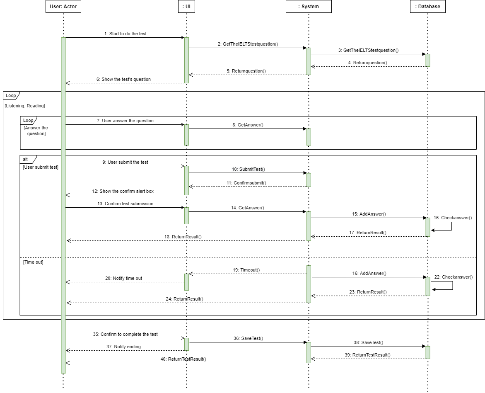
<p align= "center"> Sequence diagram represents taken a test function</p>

**REVIEW MODE:**

Once review mode is set to true, fetchReviewData is triggered, and Test page is rerendered like thus:

- The timer stops counting down.
- Users cannot change their answers (i.e, all inputs are disabled).
- Correct answers are dynamically colored in green, wrong answers red.
- A new explanation component appears in each section.

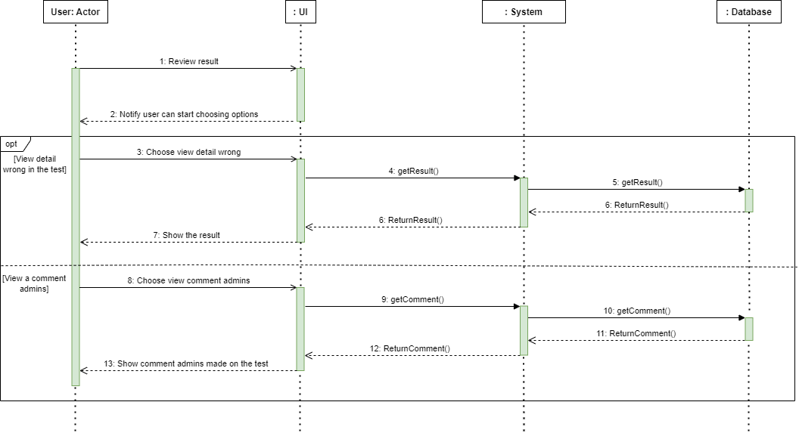
<p align= "center"> Sequence diagram represents review function</p>

### 5.5.6 Performance View <a name="performanceView"> </a>

## 5.6 Administrator management <a name="adminManager"> </a>

The administrator of the server is defined statically before the server starts. The admin is a user inside of the database.
The admin can only use the administration controller

### 5.6.1 Admin Interface <a name="adminInterface"> </a>

<!-- Add admin interface of user management and test management interfaces. -->
### 5.6.2 Backend Management <a name="backendManager"> </a>

<!-- Add content of the backend management(API) -->
Admin Backend Management functionalities should be implemented so that the admin can control all the entities inside the applicaiton including: Users, Tests, Classes. Overall, Admin has access to all [GET] methods which shows the application information. In details:
- **For students**: there are APIs to GET all users in the database. Admin can CREATE/DELETE a user from the application. The update functionality is now only limited to the user to update his account only.
- **For classes**: there are APIs to GET/CREATE/DELETE a class. Moreover, admin can control who stay in the class with the API to ADD/DELETE users from class.
- **For tests**: there are APIs to GET/DELETE a test. CREATE the test is now only accessible via the persistence layer, which provided a set of functionalities for directly inject the json-format of the test into the database.

For other entities such as **Test Result**, **User's Test Answer**, admins are not allow to access and edit those, as their consistency are strictly managed by the application. 

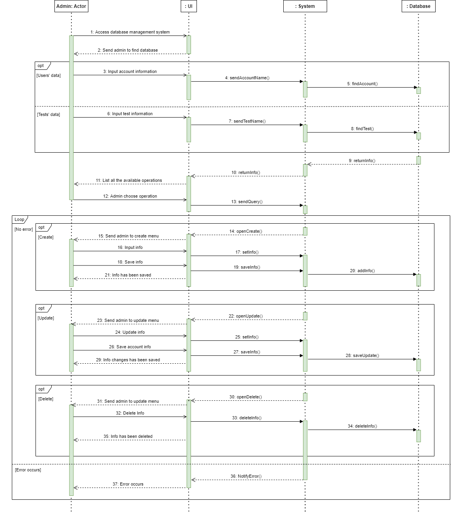
<p align= "center"> Sequence diagram represents admin management interface function</p>

--------------------------------

# 6. User manual <a name="userManual"> </a>

## 6.1 How to use the web application <a name="howToUse"> </a>

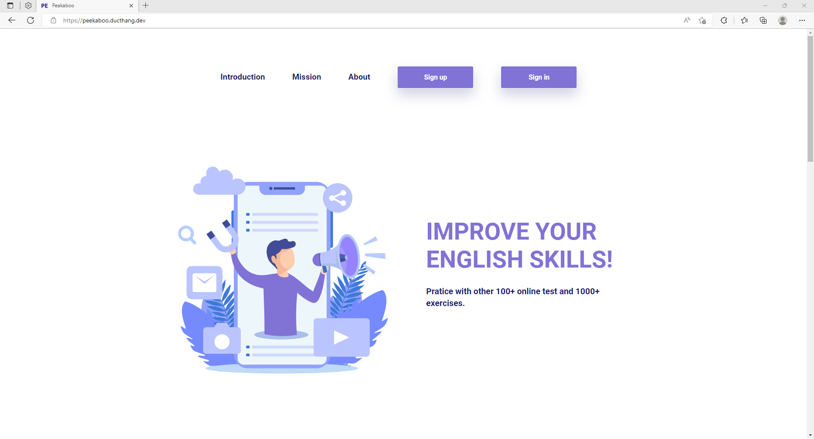
<p align= "center"> Landing page layout</p>

### 6.1.1 User registration <a name="userRegistration"> </a>

**Basic flow:**
Precondition: User should be able to access internet.

This describes the steps:

1. On the landing page, the user can see the "Signup" button on the navigation bar, click on the "Sign up button".
2. The user should fill in the box in the registration form. (Full name, Username, Password, Email, and select the Gender)
3. The user submits the registration form, and clicks the "Create Account" button.
4. If the account hasn't existed, a new account has been created. The system will be notified by the alert box on the top and automatically navigate the web browser to the login page.

Postcondition: The user has a registered account for future purposes.

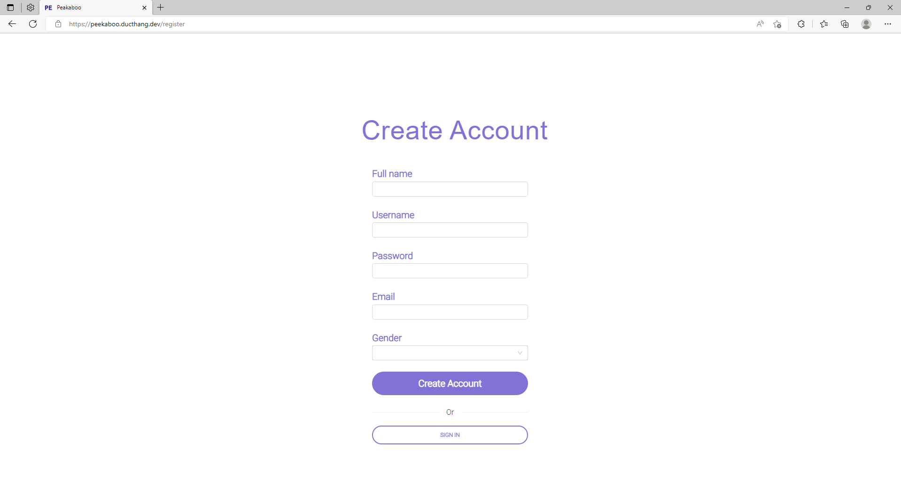
<p align= "center"> Registration page</p>

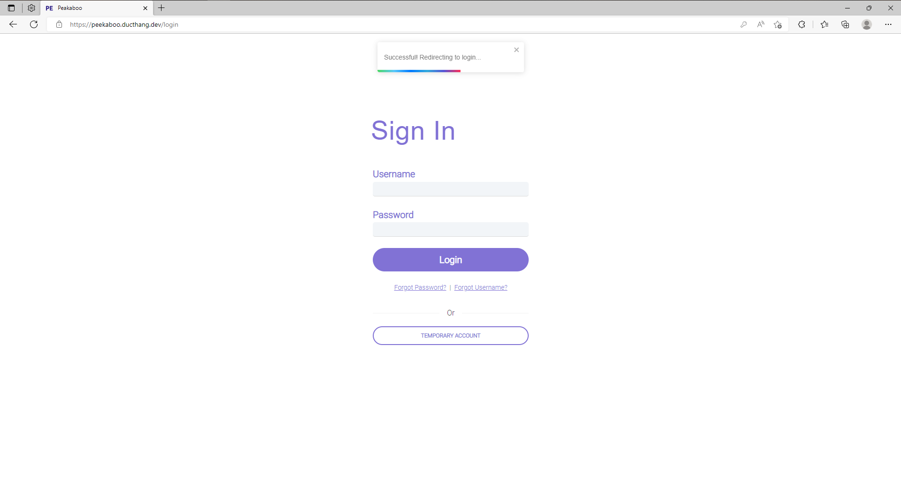
<p align= "center"> Register successfully</p>

**Note: If user don't fill in fully the registration form, the system will notify**

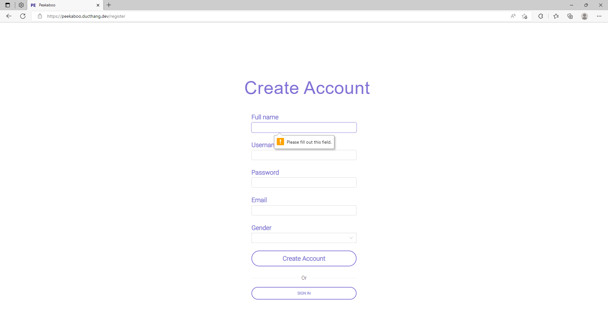
<p align= "center"> Warning message</p>

### 6.1.2 User login <a name="userLogin"> </a>

**Basic flow:**
Preconditions: User has already registered in the system.

This describes the steps:

1. On the landing page, the user can see the "Sign in" button on the navigation bar and clicks on the "Sign in button" to sign in.
2. The user enters the username and password.
3. The system accepts username and password.
4. The user successfully logged into the website and automatically navigate to the user profile.

Postconditions: The user is able to utilize the function of the service.


<p align= "center"> Login page</p>

### 6.1.3 User logout <a name="userLogout"> </a>

**Basic flow:**
Preconditions: The user has an account being logged in the system.

This describes the steps:

1. If The user clicks on the "User" button on the navigation bar, it will be dropped down. The button will be shown "Profile" and "Log out", so click on the "Log out" button.
2. The system asks for sign-out confirmation.
3. The system will be logged out and ended the session, meanwhile, it also automatically back to a Landing page.

Postcondition: The user signs out successfully.

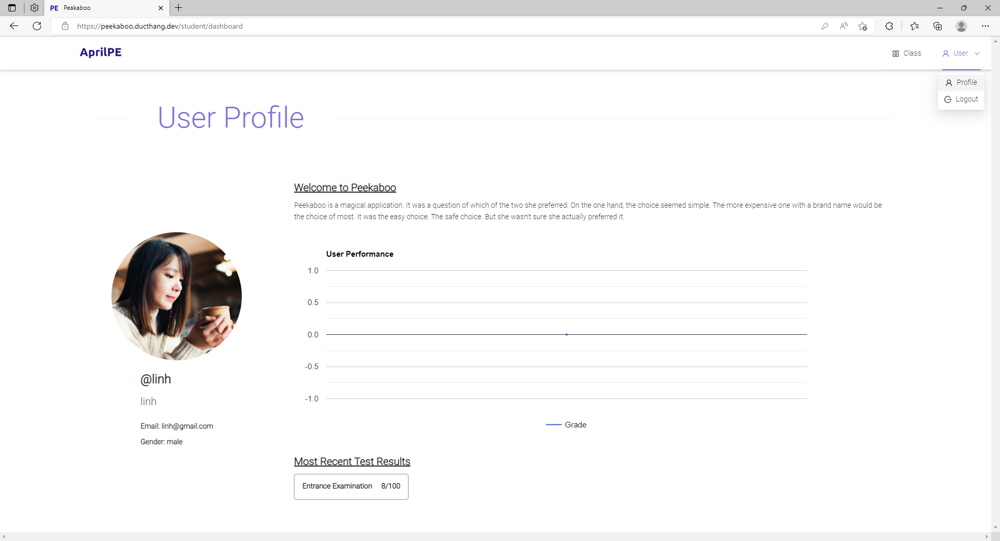
<p align= "center"> Logout function</p>

### 6.1.4 User Profile <a name="userProfile"> </a>

**Basic flow:**
Preconditions: The user has an account being logged in the system.

This describes the steps:

1. If The user clicks on the "User" button on the navigation bar, it will be dropped down. The button will be shown "Profile" and "Log out", so click on the "Profile" button.
2. The system navigates to "User Profile" page
3. User can see the User information and avatar on the left side of the page, the User Performance chart, which shows the results of the previous test, is located in the center of the page. It is very visible and clear so that user can compare their performance.

Postcondition: The user signs out successfully.


<p align= "center"> User Profile page</p>

### 6.1.5 User's class <a name="userGroup"> </a>

**Basic flow:**
Precondition: The user is assigned a class by administrator.

This describes the steps:

1. User can find the class by clicking on the "Class" button on the navigation bar.
2. The system will change to the Class page and show out all classes that student is assigned. It also shows the class information.
3. User click on the "visit" button on each Class tag.

Postcondition: The user joins the class successfully.

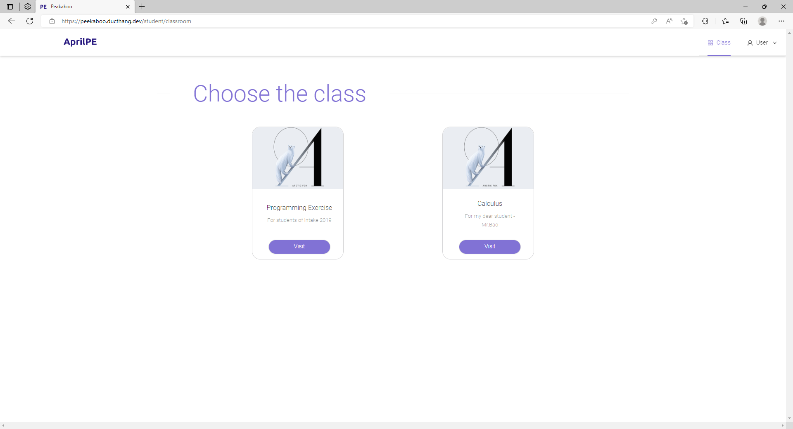
<p align= "center"> Class layout</p>

### 6.1.6 User's test assignment <a name="userTesting"> </a>

**Basic flow:**
Preconditions: The user is assigned in the group's testing.

This describes the steps:

1. The user clicks on the "visit" button on the Class tag.
2. User can see the test which is assigned by the admin in each class. Then, they click on the "Take" button to do the test. The test card also shows the Name of the test, assigned group, more details about the test, and the deadline to do the test.
3. The system will change to the "Pre-test" page and notifies the user rules of the test. The user can see the "Start" button in order to take a test, or the "Review" button if they had also taken the test before.
4. The system notifies the test starting and changes to the "Test" page.

Postcondition: The user can start to do the test.

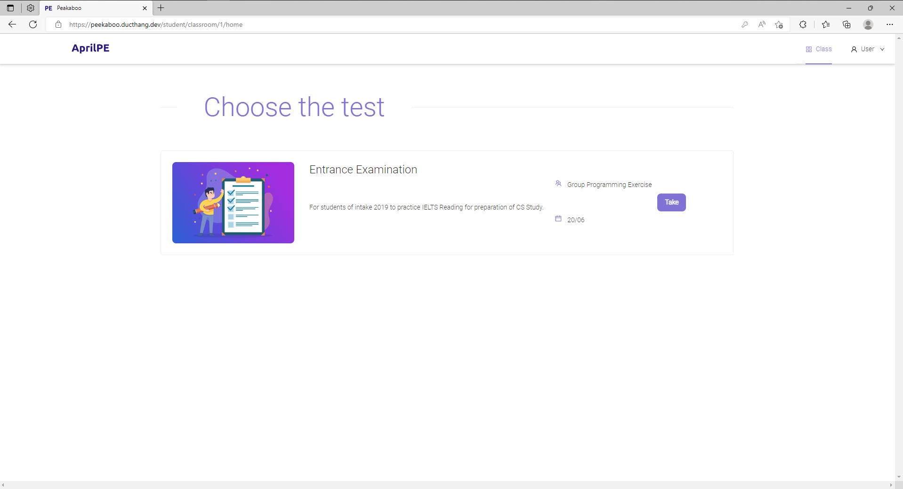
<p align= "center"> Test assignment layout</p>

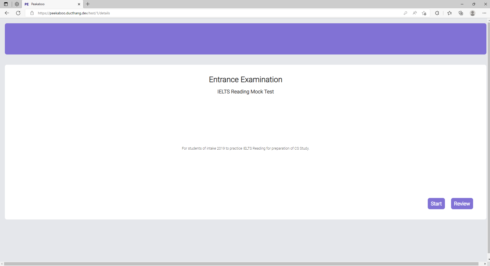
<p align= "center"> Pretest layout</p>

### 6.1.7 Doing the test <a name="doingTest"> </a>

Precondition: The user starts to do the test.
**Basic flow:**
This describes the steps:

1. The user answers the questions by filling on the blank or choosing the answer in the dropdown answer. The user can see the Countdown time to take the test at the top of the page.
2. The user can change the part of the test questions by clicking on the "Next" button on the right side of the navigation bar.
3. In the last part, The user can submit the test by clicking on the "Submit" button on the right side of the navigation bar, which is replaced "Next" button.
4. The system confirms to submit the test and shows the result of the test.

Postcondition: The system show out the result of the test.

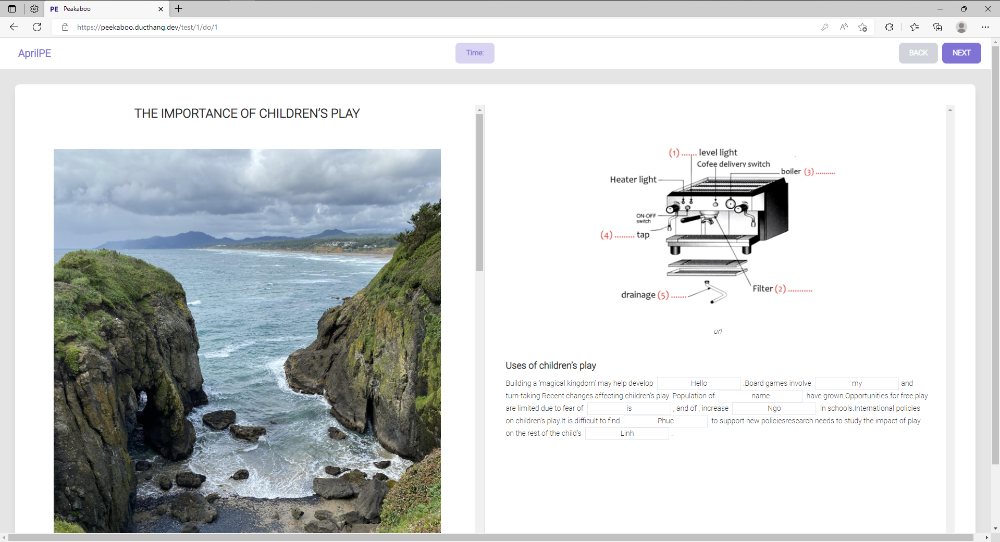
<p align= "center"> Reading test interface</p>

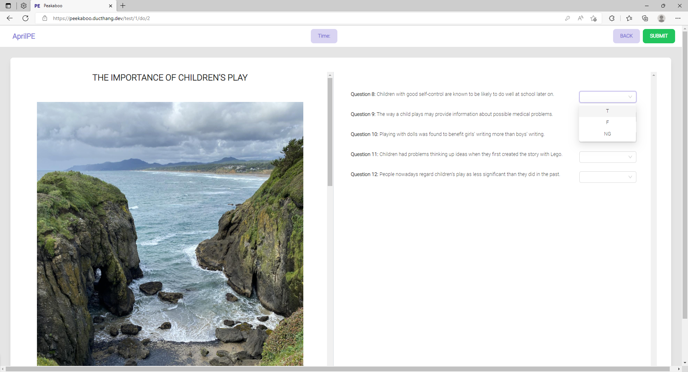
<p align= "center"> Reading test interface</p>

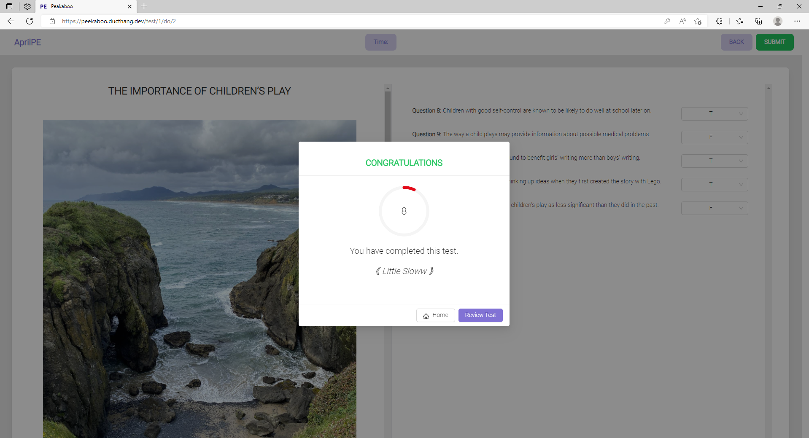
<p align= "center"> The system shows the result of the test</p>

### 6.1.8 User's performance <a name="userPerformance"> </a>

Precondition: The user completes the test.
**Basic flow:**
This describes the steps:

1. The user wants to review the test. They can click on the "Review" button on the Pretest page.
2. The system will show the wrong details in the previous test of the user.

Postcondition: The user views the test's results and wrong answers.

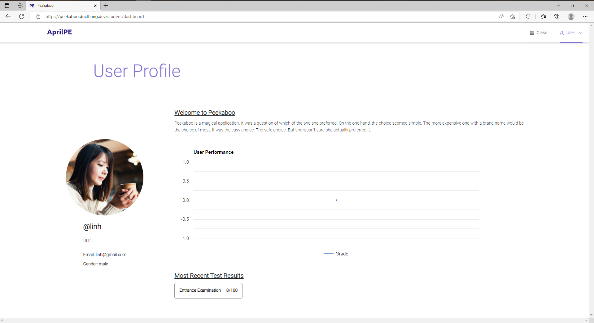
<p align= "center"> Review details test in the user profile</p>


<p align= "center"> Review button</p>

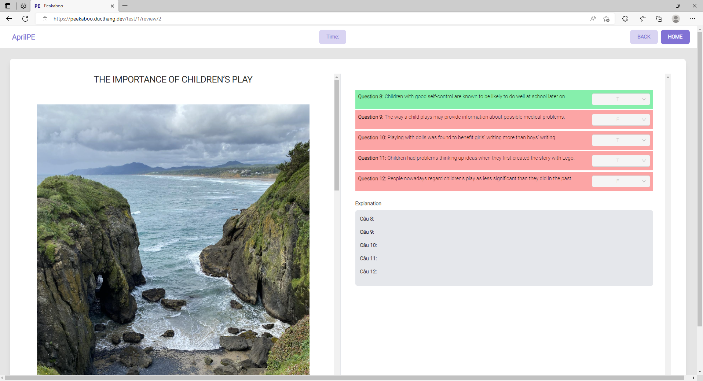
<p align= "center"> Review details test</p>

--------------------------------

# 7. Conclusion <a name="conclusion"> </a>

## 7.1 Limitation <a name="limitation"> </a>

During our time working as a team, we encountered the following back draws:

- Lack of time in working.
- Miscommunication between team members.
- Minor bugs in coding.

The project is expected to be completed in 8 weeks. Progress is documented below. The process has been very smooth, with only minor setbacks along the way. However, we believe that there is room for improvement in this project. With an extended deadline, the project can become a full-fledged website application.

## 7.2 Learning <a name="learning"> </a>

By the time of writing this report, growing is just a process not only as individuals but also as a team. Having different inputs on how to face adversity and work together as a team, we have learned to be more flexible, think outside the box, and deal with argumentative situations. Particularly, we always keep updating the project to discover the limitations, fix the bugs, and enhance specific functions of the web application. Hence, it is very important to be open to sharing experiences and receiving comments from the community.

## 7.3 Future Development <a name="future"> </a>

--------------------------------

[1]: <https://www.ibm.com/cloud/learn/three-tier-architecture> "Three-tier Architect"
[2]: <https://www.techtarget.com/whatis/definition/clean-architecture> "Clean Architecture of Uncle Bob"

# 8. Appendix A: Glossary of Terms <a name="appendixA"> </a>

| Abbreviation | Name |
| --- | --- |
| API | Application Programming Interface |
| ID | Identification |
| SQL | Structured Query Language |
| JSON | JavaScript Object Notation |

--------------------------------

# 9. Appendix B <a name="appendixB"> </a>

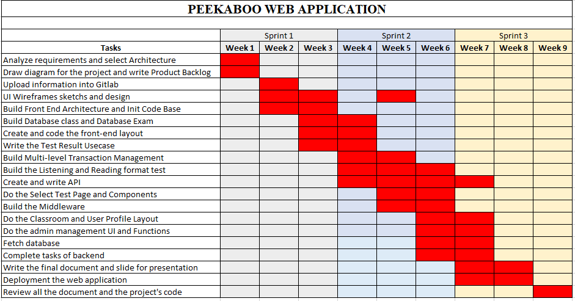
<p align= "center"> Project Gantt Chart</p>
