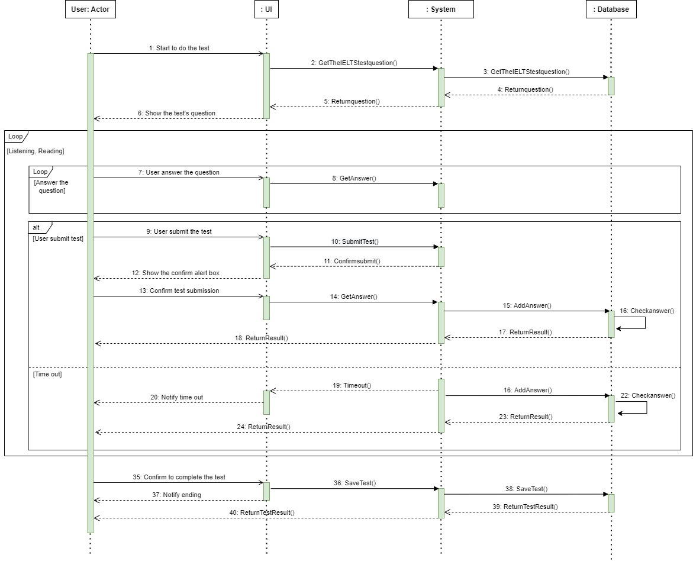

# PE2022_Team 3

## Members

+ Nguyen Duc Thang (16709) (Team Leader)
+ Hua Nhat Gia Nghi (18242)
+ Nguyen Quoc Trung (15657)
+ Nguyen Phu Khang (16580)
+ Nguyen Duy Phu Quang (15890)
+ Vu Nhat Quang (16141)
+ Ngo Phuc Linh  (14327)
+ Truong Canh Thanh Vinh (15766)

## Project Description

We are Peekaboo, a software that focuses on developing applications for users, typically students and learners, to assess their ability by doing tests. Please see the source code in the dev branch!

Background: Peekaboo resembles other assessment websites such as ieltsonlinetest.com, codeforce.com, etc. However, we improve the styles and usability of the tests so that they are personalized and customized for admins and users.

This application has 2 interfaces:

+ User Interface
+ Admin Interface

**Users after registration can:**

+ View the tests that have been assigned to them.
+ Do the tests and get the test graded by Admin.
+ View the total score of the previous tests.
+ Do the test in many styles: multiple choice, fill in the blank, writing.

**Admin of this application can:**

+ Create a test with many styles.
+ Assign the test to any Users.
+ Grade the test of the Users.
+ Analyze the scores of Users based on the test’s topics, users, or other criteria.

For the complete Project Proposal, please refer here: [Project Proposal](Peekaboo.pdf)

## Usecase

For this application, Peekaboo applies Scrum to boost the development productivity.

### Product Backlog

Product Backlog is the Master Board for teams (**Frontend**, **Backend**) to find the users’ demands. Each story will be picked for Sprint circle in order based on its priority and score. There are 2 types of user:

| Users | Note |
| --- | --- |
| Admin | [A] |
| Student | [S] |

| User Stories | Score | Priority (Top: 5 → Bottom: 1)  |
| --- | --- | --- |
| [S] I want to do test and view the score afterward.  | 2 | 5 |
| [A] I want to manage all the tests. | 2 | 5 |
| [A] I want to be able to assign test to a group/ a student. | 1.5 | 5 |
| [A] I want to grade a student’s test result. | 1.5 | 4 |
| [S] I want to view what I have done wrong in the test. | 1.5 | 4 |
| [S] I want to view my progress, and others people progress through time. | 1 | 3 |
| [A] I want to view student’s performance through time on a cluster: {group, test, student} | 1 | 3 |
| [S] I want to view the comment admins made on my test. | 1 | 2 |

---

### Usecase Diagram

---

### Class Diagram

---

### ER Diagram

<h1 style align="center">User Sequence Diagram</h1>

This is the diagram that shows how user use website

### 1. Registration function

**Basic flow:**
This describes the steps:

1. The user attempts to login
2. The user fills in the registration form
3. The user submits the registration form
4. The system checks the information
5. The system sends authentication code to the user
6. The user fills in the code
7. The account has been created

 Registration diagram 

### 2. Log in function

**Basic flow:**
This describes the steps:

1. The user enters username and password
2. The system check for existing username/password in the database
3. The system accepts username and password
4. The user successfully logged into the website
5. The system adds user session
6. The system checks previous session, then delete it

 Login diagram 

### 3. Log out function

**Basic flow:**
This describes the steps:

1. The user chooses to log out
2. The system asks for sign-out confirmation
3. The system deletes the user session

 Logout diagram 

### 4. Edit profile function

**Basic flow:**
This describes the steps:

1. The user selects Edit profile function in the settings
2. The system changes to the Edit profile function
3. The user adjusts the information
4. The system sends authentication code to the user
5. The user enters the code
6. The system verifies the code
7. The information has successfully been updated

 Logout diagram 

### 5. Choose the test function

**Basic flow:**
This describes the steps:

1. The user chooses the test
2. The system notifies user can choose test's types
3. The system notifies the choosen test

 Choose the test function diagram

### 6. Choose the Basic test function

**Basic flow:**
This describes the steps:

1. The user starts to do the test
2. The user answers the question
3. The user submits the test
4. The system confirms to submit the test
5. The system checks the answer and shows the results

 Choose the Basic test function diagram 

### 7. Choose the IELTS test function

**Basic flow:**
This describes the steps:

1. The user starts to do the test
2. The user answers the question
3. The user submits the test
4. The system confirms to submits the test
5. The system checks the answer and shows the results

 Choose the IELTS test function diagram 

### 8. Review function

**Basic flow:**
This describes the steps:

1. The user wants to review the test
2. The user chooses to view wrong details in the previous test
3. The system gets the information from the database to show the results
4. The user chooses to view the comment by the administrator
5. The system gets the information from the database to show the comments

 Review function diagram 

### 9. View the progress function

**Basic flow:**
This describes the steps:

1. The user views the progress
2. The user chooses to view personal performance
3. The system gets the information from the database to show the user's performance
4. The user chooses to view the other performance
5. The system gets the information from the database to show others' performance

 View the performance function diagram 

<h1 style align="center">Admin Sequence Diagram</h1>

This is the diagram that shows how admin use and control the website

### 1. Log in function

**Basic flow:**
This describes the steps:

1. The administrator enters username and password
2. The system checks for existing username/password in the database
3. The system accepts username and password
4. The administrator successfully logged into the website
5. The system adds administration session

 Admin Login diagram 

### 2. Log out function

**Basic flow:**
This describes the steps:

1. The administrator chooses to log out
2. The system asks for sign-out confirmation
3. The system deletes the user session

 Logout diagram 

### 3. Management function

**Basic flow:**
This describes the steps:

1. Administrator locates the user's account or the test information in the database
2. The administrator selects the functions to perform on the discovered account or discovered test
3. The system receives the query and transmits it to the database
4. The query is executed by the database
5. The database informs the system of the outcome
6. The system shows the results to the administrator

 Management function diagram 

### 4. View the performance function

**Basic flow:**
This describes the steps:

1. The administrator views the performance data
2. The administrator chooses to view users' performance or tests' performance
3. The system gets the information from the database to show the user's performance
4. The administrator chooses to view the other performance
5. The system gets the information from the database to show tests' performance

 View the performance function diagram 

### 5. Judgement function

**Basic flow:**
This describes the steps:

1. The administrator chooses to judge user
2. The administrator chooses to grade the test or comment on the test
3. The system gets the information from the database to show the test
4. The administrator inputs the score or comments on the test
5. The system saves the score or comments on the test to the database and notifies the information has been saved

 Judgement function diagram 

### 6.Assign a test function

**Basic flow:**
This describes the steps:

1. The administrator assigns the test
2. The administrator creates the group user
3. The system gets the user data from the database and show the users' list
4. The administrator selects the user and adds it to the group
5. The system saves the group and notifies message to the selected user.
6. The administrator selects the test and selects the group
7. The system assigns to the group
8. The system saves the group and notifies message to the selected user

 Assign A Test function diagram 

---

### 1.Log in layout

**Basic flow:**
This describes the steps:

1. Two fill Username and Password
2. Forgot password function
3. Log in button
4. Link to Sign up

 Mobile Log in 

 Web Log in 

### 2.Sign up personal info layout

**Basic flow:**
This describes the steps:

1. Four fill Fullname, Gender, DOB, Hear about us
2. Link to Log In
3. Continue button

 Mobile Sign up personal info 

 Web Sign up personal info 

### 3.Sign up account details layout

**Basic flow:**
This describes the steps:

1. Four fill Email ID, Create Password, Phone number, Creadit card info
2. Link to Log In
3. Back button
4. Submit button

 Mobile Sign up account details 

 Web Sign up account details 

### 4.Home page layout

**Basic flow:**
This describes the steps:

1. Start button to Login

 Mobile Home page 

 Web Home page 

### 6.Group page layout: 
**Basic flow:**
This describes the steps:

1. Image and Title
2. Join button

 Mobile Group page 

 Web Group page 

### 7.Test page layout

**Basic flow:**
This describes the steps:

1. Image and Title
2. Take button

 Mobile Test page 

 Web Test page 

### 8.Listening test page layout

**Basic flow:**
This describes the steps:

1. Bookmark for test, time and submit button
2. Question and Answer
3. Control bar for listening test

 Mobile Listening Test Page 

 Web Listening Test Page 

### 9.Reading test page layout: 
**Basic flow:**
This describes the steps:
1. Bookmark for test, time and submit button
2. Question and Answer

 Mobile Reading Test Page 

 Mobile Reading Script Page 

 Web Reading Test Page 

### 10.Listening Review page layout: 
**Basic flow:**
This describes the steps:

1. Listening Script
2. Question and Answer
3. Control bar for listening test

 Web Listening Review Page 

 Mobile Listening Review Page 

 Mobile Listening Script Page 

### 11.Reading Review page layout: 
**Basic flow:**
This describes the steps:
1. Reading Script
2. Question and Answer

 Web Reading Review Page 

 Mobile Reading Review Page 

 Mobile Reading Script Page 

### 12.Score page layout: 
**Basic flow:**
This describes the steps:
1. Score
2. Line Chart

 Web Score Page 

 Mobile Score Page 

### 12.Before the Test page layout: 
**Basic flow:**
This describes the steps:
1. Paragraph
2. Start button

 Web Before the Test Page 

 Web Before the Test Page 

### 13.Create the Test admin page layout: 
**Basic flow:**
This describes the steps:
1. Test card
2. Create button

 Web Create the Test Admin Page 

 Mobile Create the Test Admin Page 

### 14.Search Information admin page layout: 
**Basic flow:**
This describes the steps:
1. Search bar
2. Create button

 Web Search Information Admin Page 

 Mobile Search Information Admin Page 

### 15.Create File admin page layout: 
**Basic flow:**
This describes the steps:
1. File Card
2. Create button
3. Upload Image File
4. Update Audio File

 Web Create File Admin Page 

### 15.Create Question admin page layout: 
**Basic flow:**
This describes the steps:
1. Question Card
2. Create button
3. Upload Question

 Web Create Question Admin Page 

### 16.Create Group admin page layout: 
**Basic flow:**
This describes the steps:
1. Group info Card
2. Create button

 Web Create Group Admin Page 

 Mobile Create Group Admin Page 

